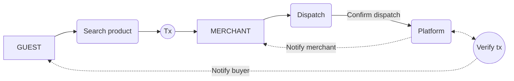

## App flow



## Product search
```ts
async function searchProducts(productId: string) {
  const { data, error } = await supabase.from("products")
    .select()
    .eq("_id", productId)
  return { data, error }
}
// Server
type DispatchArgs = {
  buyerWallet: string;
  orderId: IProduct;
  deliveryAddress: IAddress;
  email: string
}
```
## Shipping
```ts
async function dispatch(args:DispatchArgs) {
  let data; let error;
  const {
    buyerWallet,
    orderId,
    deliveryAddress,
    email,
    user,
  } = args;
  try {
    data = await axios.post(process.env.DELIVERY_API, {
      buyerWallet,
      orderId,
      deliveryAddress,
      email,
      user,
    })
    const { data: userData, error: userError } = await supabase.from("users")
      .update({
        status: "dispatched",
        [new Date().toISOString()]: {
          ...data,
          status: dispatched
        },
      })
      .eq("id", user.id)
  } catch (e) {
    error = e;
  }
  return { data, error }
}
```
## Transactions
```ts
import { sendTransaction } from '@wagmi/core'
import { parseEther } from 'viem'
import { config } from './config'
import { http, createConfig } from '@wagmi/core'
import { mainnet, sepolia } from '@wagmi/core/chains'

export const config = createConfig({
  chains: [mainnet, sepolia],
  transports: {
    [mainnet.id]: http(),
    [sepolia.id]: http(),
  },
})
type PurchaseArgs = {
  sellerWallet: string;
  productId: IProduct;
  productPrice: string;
  deliveryAddress: IAddress;
  email: string
}
async function purchase(args:PurchaseArgs) {
  const {
    sellerWallet: string;
    productId: IProduct;
    productPrice: string;
    deliveryAddress: IAddress;
    email: string
  } = args;
  let data; let error;
  try {
    data = await sendTransaction(config, {
      to: sellerWallet,
      value: parseEther(productPrice),
    })
  } catch (e) {
    error = e;
  }
  return { data, error }
}
```